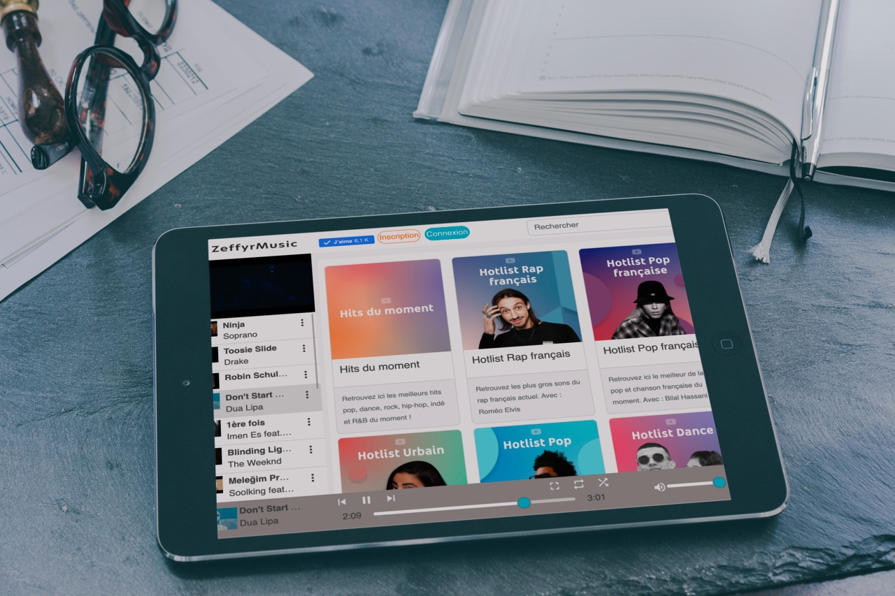

# ZeffyrMusic

🚀 ZeffyrMusic is a web-based music streaming application built with Angular. It allows users to explore and listen to music online while managing playlists and favorites.

This project was generated with [Angular CLI](https://github.com/angular/angular-cli) version 7.3.3.

## Development server

Run `ng serve` for a dev server. Navigate to `http://localhost:4200/`. The app will automatically reload if you change any of the source files.

## Code scaffolding

Run `ng generate component component-name` to generate a new component. You can also use `ng generate directive|pipe|service|class|guard|interface|enum|module`.

## Build

Run `ng build` to build the project. The build artifacts will be stored in the `dist/` directory. Use the `--prod` flag for a production build.

## Running unit tests

Run `ng test` to execute the unit tests via [Vitest](https://vitest.dev/).

## Running end-to-end tests

Run `ng e2e` to execute the end-to-end tests via [Cypress](https://www.cypress.io/).

## Further help

To get more help on the Angular CLI use `ng help` or go check out the [Angular CLI README](https://github.com/angular/angular-cli/blob/master/README.md).

## Description

Zeffyrmusic is a music web application developed with Angular. This project demonstrates advanced usage of Angular to create a feature-rich, performant, and maintainable application.

## Features

- **Music Search**: Advanced search for songs, albums, and artists.
- **Music Playback**: Integration with YouTube for music video playback.
- **Playlists**: Create and manage custom playlists.
- **Dark Mode**: Support for dark mode for a better user experience.
- **Internationalization**: Multi-language support with Transloco.

## Technologies Used

- **Angular**: Main framework for application development.
- **RxJS**: Reactive programming for data streams management.
- **NgBootstrap**: Bootstrap components for Angular.
- **Transloco**: Internationalization and localization.
- **Angular CLI**: Command-line tools for Angular.
- **Cypress**: End-to-end testing.
- **Vitest**: Unit testing framework.
- **YouTube Player API**: Integration with YouTube for video playback.

## Screenshots

### ZeffyrMusic in 2014

### ZeffyrMusic in 2020

[Production server](https://www.zeffyrmusic.com/)
