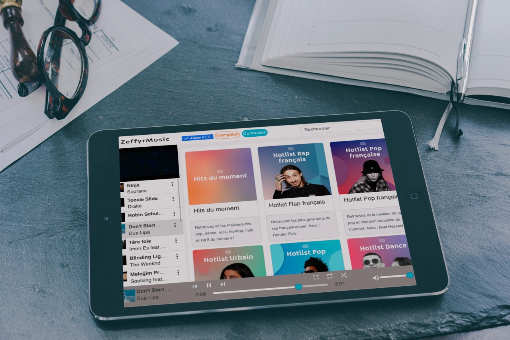

# ZeffyrMusic

🎵 **ZeffyrMusic** is a modern music streaming web application built with **Angular 22**. It allows users to explore and listen to music online while managing playlists and favorites.

[](https://codecov.io/github/zeffyr-000/zeffyrmusic)
[](https://angular.dev/)

🌐 **[Production server](https://www.zeffyrmusic.com/)**

---

## ✨ Features

- 🔍 **Music Search**: Advanced search for songs, albums, and artists
- ▶️ **Music Playback**: Integration with YouTube for music video playback
- 📋 **Playlists**: Create and manage custom playlists
- ❤️ **Favorites**: Like and save your favorite tracks
- 🌙 **Dark Mode**: Support for dark mode for a better user experience
- 🌍 **Internationalization**: Multi-language support (French/English) with Transloco
- 📱 **Responsive**: Mobile-first responsive design

---

## 🚀 Tech Stack

### Core

| Technology        | Version | Purpose                       |
| ----------------- | ------- | ----------------------------- |
| **Angular**       | 22.x    | Frontend framework            |
| **@ngrx/signals** | 21.x    | State management with signals |
| **RxJS**          | 7.x     | Reactive programming          |
| **TypeScript**    | 6.0     | Type-safe JavaScript          |

### UI & Styling

| Technology         | Purpose                      |
| ------------------ | ---------------------------- |
| **Bootstrap 5**    | CSS framework                |
| **NgBootstrap**    | Angular Bootstrap components |
| **SCSS**           | Styling preprocessor         |
| **Material Icons** | Icon library                 |

### Testing

| Technology     | Purpose      |
| -------------- | ------------ |
| **Vitest**     | Unit testing |
| **Playwright** | E2E testing  |

### Tooling

| Technology      | Purpose              |
| --------------- | -------------------- |
| **Angular CLI** | Development tooling  |
| **ESLint**      | Code linting         |
| **Prettier**    | Code formatting      |
| **Transloco**   | Internationalization |

---

## 🏗️ Architecture Highlights

### Modern Angular Patterns

- ✅ **Zoneless Change Detection** - No Zone.js for optimal performance
- ✅ **Signal-Based State** - 5 Signal Stores (Auth, Player, Queue, UserData, UI)
- ✅ **Signal Forms** - Experimental Signal Forms API with Transloco i18n
- ✅ **Standalone Components** - 100% standalone, no NgModules
- ✅ **OnPush Everywhere** - All components use OnPush change detection
- ✅ **SSR with Hydration** - Server-side rendering with client hydration
- ✅ **Strict TypeScript** - Full strict mode enabled

### Performance Optimizations

- 📦 **Bundle Budget**: < 1.5MB initial load
- 🚀 **Lazy Loading**: All routes lazy-loaded
- 🖼️ **Image Optimization**: Lazy loading directives
- ⚡ **Fine-grained Reactivity**: Signal-based updates

### CSS Architecture (Refactored January 2026)

- 🎨 **Component-Scoped CSS**: 67% reduction in global CSS
- 📝 **English Naming**: Consistent kebab-case conventions
- 🏗️ **Documented Architecture**: Comprehensive CSS documentation
- ⚠️ **Critical Rules**: YouTube player integration guidelines

> 📖 See [docs/ARCHITECTURE.md](docs/ARCHITECTURE.md) for detailed architecture documentation.
> 🎨 See [docs/CSS_ARCHITECTURE.md](docs/CSS_ARCHITECTURE.md) for CSS/SCSS guidelines.

---

## 📋 Prerequisites

- **Node.js** >= 22.x
- **npm** >= 10.x
- **Angular CLI** >= 22.x

---

## 🛠️ Installation

```bash
# Clone the repository
git clone https://github.com/zeffyr-000/zeffyrmusic.git
cd zeffyrmusic

# Install dependencies
npm install
```

---

## 💻 Development

### Development Server

```bash
npm start
# or
ng serve
```

Navigate to `http://localhost:4200/`. The app will automatically reload on file changes.

### Development with SSR

```bash
npm run dev:ssr
```

---

## 🧪 Testing

### Unit Tests

```bash
# Run all tests
npm test

# Run tests in watch mode
npm run test:watch

# Run tests with coverage
npm run test:coverage
```

**Current coverage**: 527 tests passing ✅

### E2E Tests

```bash
# Run Playwright E2E tests
npm run e2e

# Open Playwright interactive UI
npm run e2e:ui
```

---

## 📦 Building

### Development Build

```bash
ng build
```

### Production Build

```bash
ng build --configuration production
```

Build artifacts are stored in the `dist/` directory.

---

## 🔧 Configuration

### TypeScript Strict Mode

The project uses strict TypeScript configuration:

```json
{
  "compilerOptions": {
    "strict": true,
    "noImplicitOverride": true,
    "noPropertyAccessFromIndexSignature": true,
    "noImplicitReturns": true,
    "noFallthroughCasesInSwitch": true
  },
  "angularCompilerOptions": {
    "strictInjectionParameters": true,
    "strictInputAccessModifiers": true,
    "strictTemplates": true
  }
}
```

### Environment Configuration

- `environment.ts` - Development
- `environment.staging.ts` - Staging
- `environment.prod.ts` - Production

---

## 📁 Project Structure

```
src/
├── app/
│   ├── store/           # Signal stores (@ngrx/signals)
│   │   ├── auth/        # Authentication state
│   │   ├── player/      # Player state
│   │   ├── queue/       # Music queue
│   │   ├── ui/          # UI state
│   │   └── user-data/   # User data (playlists, likes)
│   ├── services/        # Business logic services
│   ├── directives/      # Custom directives
│   ├── pipes/           # Custom pipes
│   ├── models/          # TypeScript interfaces
│   └── [features]/      # Feature components
├── assets/
│   ├── i18n/            # Translation files
│   └── img/             # Images
└── styling/             # Global SCSS
```

---

## 🌍 Internationalization

The app supports multiple languages via Transloco:

- 🇫🇷 French (default)
- 🇬🇧 English

Translation files are in `src/assets/i18n/`.

---

## 📸 Screenshots

### ZeffyrMusic in 2014


### ZeffyrMusic in 2020



---

## 📚 Documentation

- [Architecture Documentation](docs/ARCHITECTURE.md)
- [Angular Documentation](https://angular.dev/)
- [ng-bootstrap Documentation](https://ng-bootstrap.github.io/)
- [RxJS Documentation](https://rxjs.dev/)

---

## 🛠️ Built With

- [Angular](https://angular.dev/) - Web application framework
- [NgRx Signal Store](https://ngrx.io/) - State management with signals
- [ng-bootstrap](https://ng-bootstrap.github.io/) - Bootstrap components for Angular
- [RxJS](https://rxjs.dev/) - Reactive programming
- [Transloco](https://jsverse.github.io/transloco/) - Internationalization
- [YouTube API](https://developers.google.com/youtube) - Music playback

---
